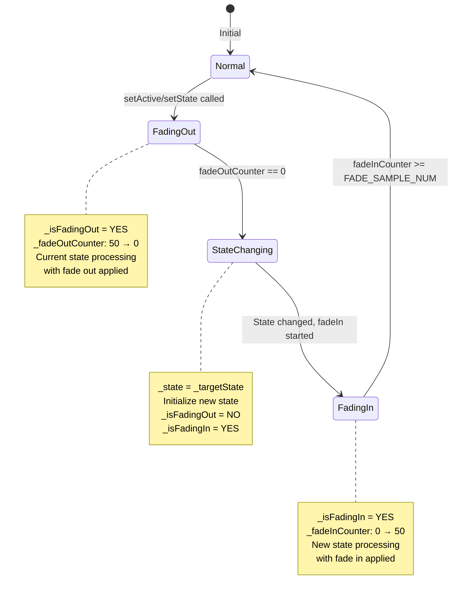
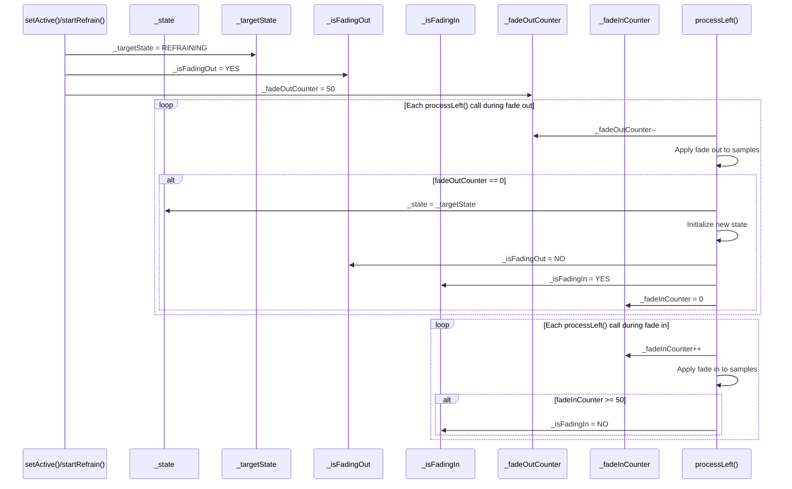
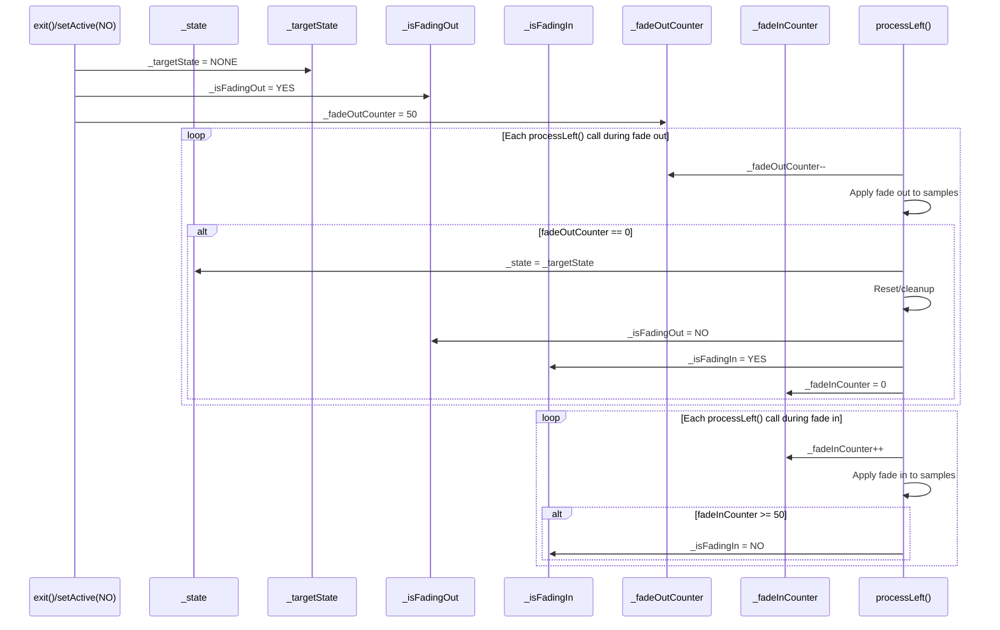
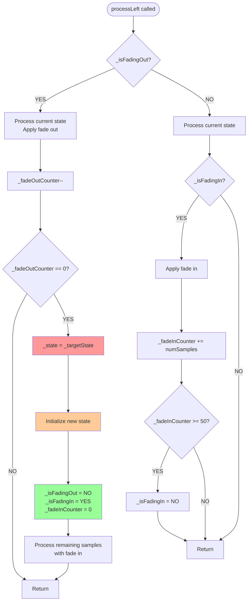
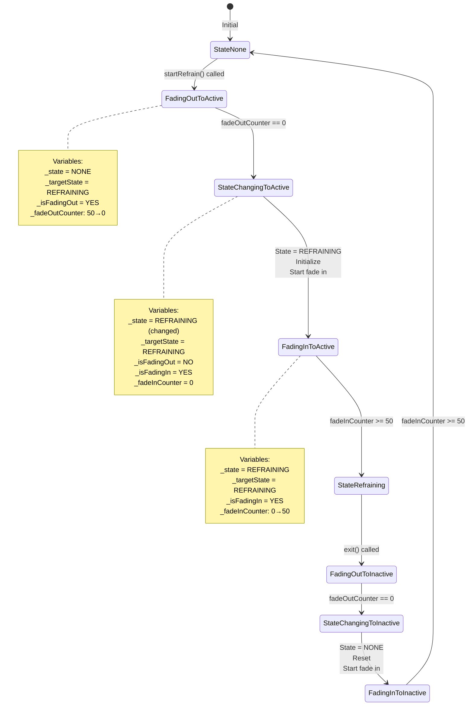
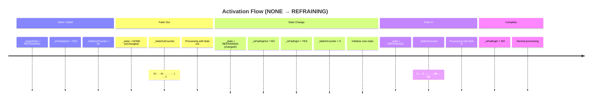
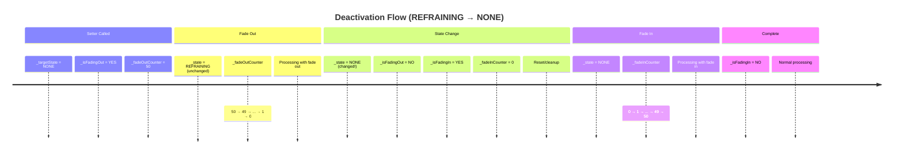

# Fade Transition State Diagram

## State Transition Overview



## Variable Value Transitions

### Activation Flow (NONE → REFRAINING)



### Deactivation Flow (REFRAINING → NONE)



## Variable Value Transition Table

### Activation (NONE → REFRAINING)

```mermaid
gantt
    title Variable Values During Activation
    dateFormat X
    axisFormat %s
    
    section State
    _state = NONE           :0, 1
    _state = REFRAINING     :1, 100
    
    section Target
    _targetState = REFRAINING :0, 100
    
    section Flags
    _isFadingOut = YES      :0, 1
    _isFadingOut = NO       :1, 100
    _isFadingIn = YES       :1, 2
    _isFadingIn = NO        :2, 100
    
    section Counters
    _fadeOutCounter: 50→0   :0, 1
    _fadeInCounter: 0→50    :1, 2
```

## Process Flow Diagram



## State Machine Detail



## Variable Timeline

### Activation Timeline



### Deactivation Timeline



