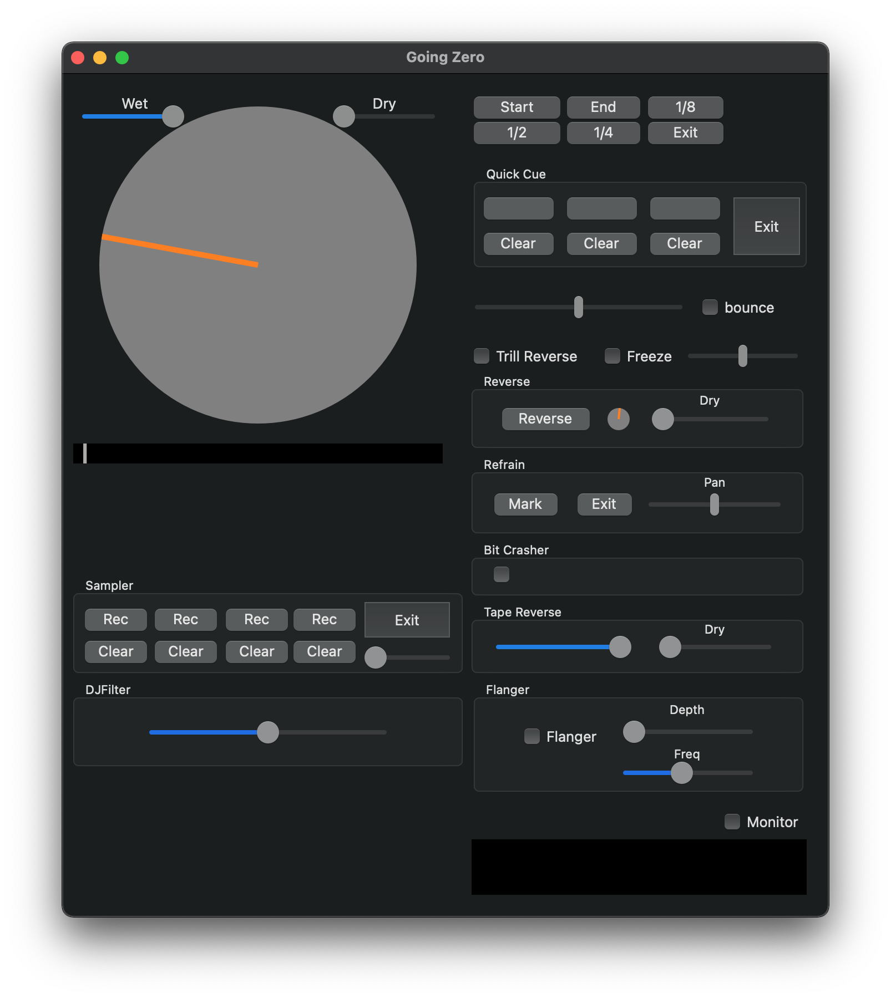
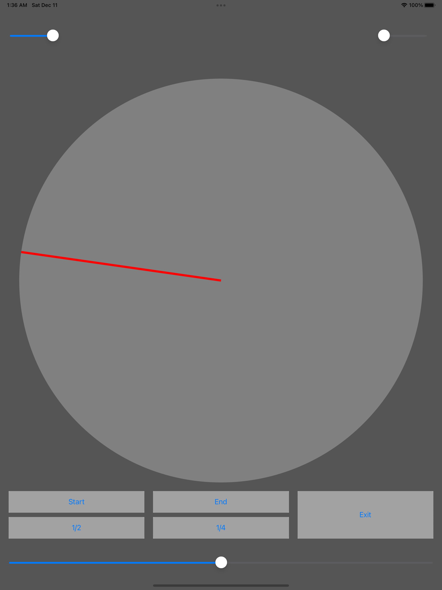

## Going Zero for Mac

"Going Zero for Mac" is a Mac application which enable you to do some DJ tricks like scratch, loop ,, on any streaming service like Apple Music/Spotify/Youtube

trick list:
- Scratch
- Loop
- Reverse
- Tap Stop
- Tape Reverse
- Freeze
- Cue
- Refrain
- DJ Filter
- Flanger
- Random

### Download Going Zero for Mac
https://github.com/kyab/Going-Zero/releases

### Demo

## Going Zero Controller(iOS)
"Going Zero Controller" is an iOS app to control "Going Zero for Mac" running on same Wi-Fi network from your iPhone/iPad.

### Download Going Zero Controller
To be here.

### Demo

### Support or Contact

Having trouble with Gong Zero ? Please let me know via [Email](kyossi212@gmail.com) or [Twitter](https://twitter.com/kyab212)
